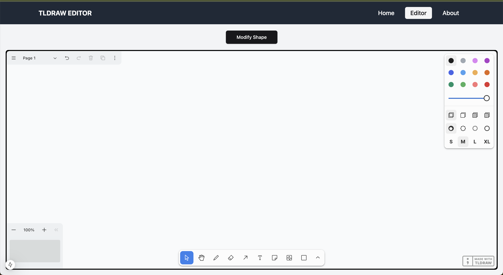

# Drawing Editor App

An intuitive drawing and shape-editing tool built with modern web technologies. This app showcases best practices in development, offering a seamless and user-friendly experience for creating, modifying, and managing shapes.

### Features

- Create and edit shapes dynamically.
- Randomly cycle through shape types with ease (rectangle, triangle, ellipse, etc.).
- Auto-save feature to persist changes between sessions.
- Clean and responsive design with real-time updates.

---

## Editor page



---

## Technologies Used

### Frontend

- [Next.js](https://nextjs.org/): Handles app structure, routing, and API routes, providing server-side rendering for efficient data fetching and rendering.
- [React](https://react.dev/): Powers the component-based user interface, ensuring a dynamic and interactive experience.
- [TailwindCSS](https://tailwindcss.com/): Enables rapid styling with a utility-first approach, delivering a clean and modern design.
- [Shadcn/UI](https://ui.shadcn.com/): Provides pre-designed, reusable components to enhance visual appeal and usability.
- [Tldraw](https://tldraw.dev/): The core library for the drawing editor, enabling advanced shape-editing capabilities and intuitive interactions.

### Backend

- [tRPC](https://trpc.io/): Ensures type-safe communication between the frontend and backend, simplifying data flow.
- [Node.js](https://nodejs.org/en): Provides the runtime for backend logic.
- [Zod](https://zod.dev/): A powerful TypeScript-first schema validation library used for validating and parsing API inputs and outputs, ensuring data integrity and type safety.

- [File System (fs)](https://nodejs.org/api/fs.html): Persists data locally by reading and writing a data.json file.

---

## Getting Started

Follow these steps to run the project locally.

### Prerequisites

- **Node.js** (v16 or later)
- **npm** (v8 or later) or **yarn** (v1 or later)

### Installation

1. Clone the repository

```bash
git clone https://github.com/TomasGarciaDev/vidext-tldraw-editor-app
cd vidext-tldraw-editor-app
```

2. Install dependencies

```bash
npm install

# or

yarn install
```

### Running the app locally

1. Start the development server

```bash
npm run dev
# or
yarn dev
```

2. Access the app opening your browser and navigate to:

```bash
http://localhost:3000
```

### How to Use

1. Navigate to the **Editor** page.
2. Use the drawing area to create and edit shapes.
3. Modify selected shapes using the **Modify Shape** button.
4. Reload the page to see the saved state restored automatically.
